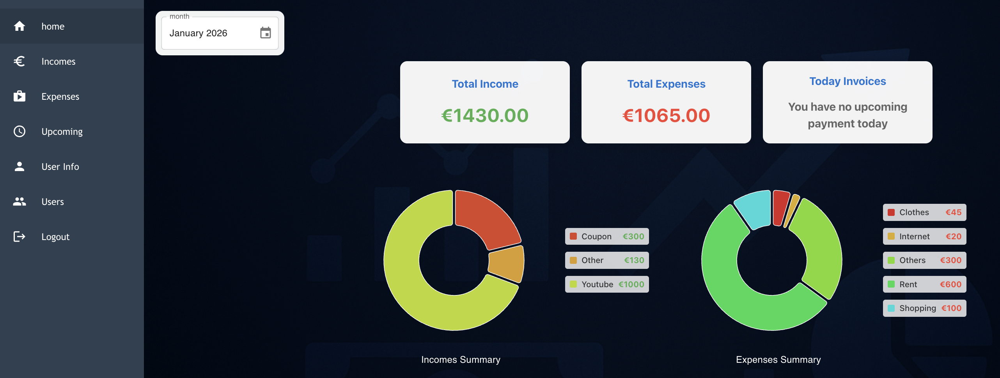
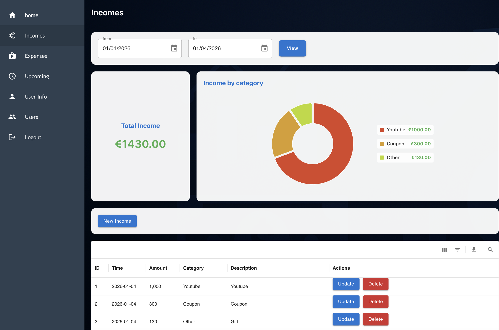
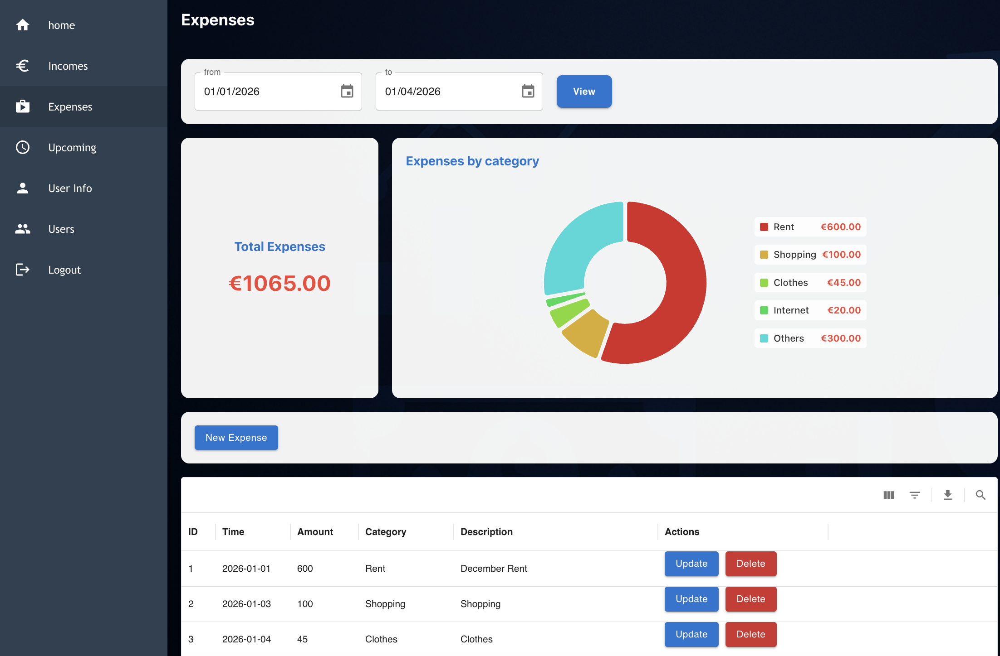
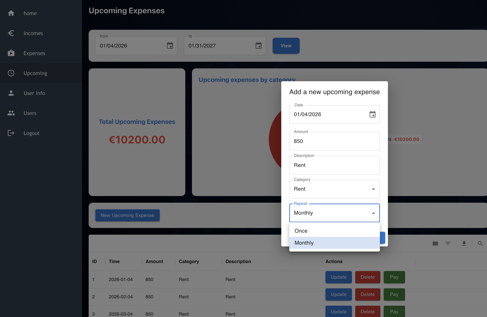

# Personal Finance Managment 💵💰
[](https://go.dev/)
[](LICENSE)

## Management of incomes and expenses

#### A web application for personal finance managing of incomes and expenses.


## Preview






## Build With
- **Golang**
- **GIN**
- **Javascript**
- **React**
- **Docker**
- **PostgreSQL**

## Features
- **Sign UP**
- **JWT-based authentication**
- **HTTPS**
- **CORS Enabled**
- **Authorization**
- **Add a new income**
- **Update/Delete a current income**
- **Add a new expense**
- **Update/Delete a current expense**
- **Add a new upcoming expense - once or monthly for a full year**
- **Update/Delete an upcoming expense**
- **Set a personal category for each incomes/expenses**
- **View list of all categories while adding**
- **Time-range search filter on incomes/expense**
- **Category-based search filter on incomes/expense**
- **Sort incomes/expenses by ...**
- **Get a CSV report of incomes/expenses**

**Profile**
- **View/Edit user profile**
<!-- - **Upload a profile picture** -->

**Admin**
- **Add/Update/Delete a user**


## Installation
```bash
git clone https://github.com/zianazari/personal-finance-managment.git
cd personal-finance-managment

# start database
make initdb

# on mac or linux
make mac
# run application
./personal_finance_management

# on windows
make windows
# run application
personal_finance_management.exe
```
In a browser:
```bash
https://localhost:443
```
